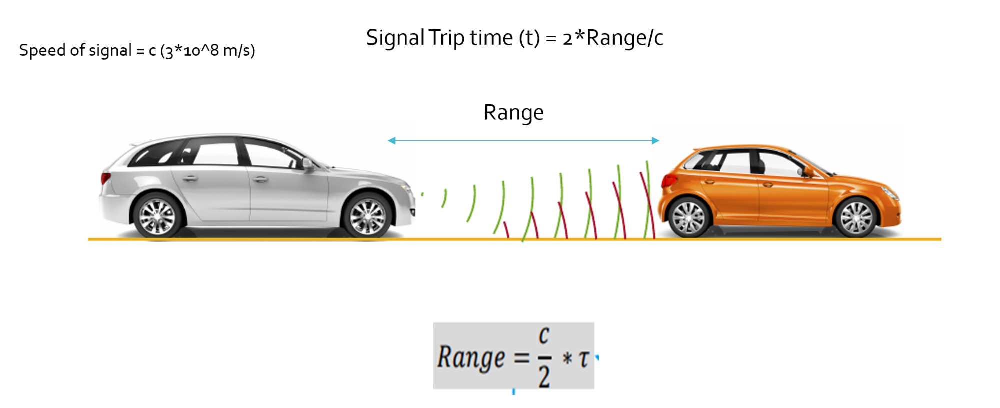
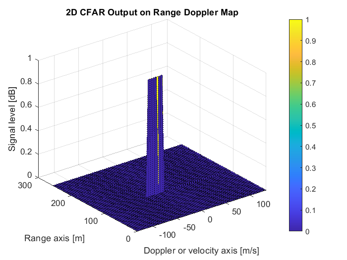

# SFND Radar Target Generation and Detection
  
<p style="color:black;font-size:14px;">

<em><br>Figure 1: Project layout to simulate Radar Target Generation and Detection (Source: Udacity)</em>
</p>


 
## Project Overview

* Configure the FMCW waveform based on the system requirements.
* Define the range and velocity of target and simulate its displacement.
* For the same simulation loop process the transmit and receive signal to determine the beat signal
* Perform Range FFT on the received signal to determine the Range
* Towards the end, perform the CFAR processing on the output of 2nd FFT to display the target.


### Radar System Requirements


## Define the range and velocity of target and simulate its displacement.


% Frequency of operation = 77GHz
% Max Range = 200m
% Range Resolution = 1 m
% Max Velocity = 100 m/s


|Desired Radar signal properties|Symbol|Value and Unit|
|:------------------------------|:-------|:-------------|
|Operating carrier frequency|fc|77 GHz|
|Speed of light|c|~3.0e8 m/s|
|Max. target detection range|r_t_max|200 m|
|Range resolution|r_t_res|1 m|
|Max. target velocity|v_t_max|70 m/s|
|Velocity resolution|v_t_res|3 m/s|


### FMCW Waveform Design

Using the given system requirements the FMCW waveform parameters are derived including bandwidth (B_sweep or B_chirp), chirp time (T_sweep or T_chirp) and slope (slope) of the periodic chirp sweep signals shown in figure 2. For the given system requirements the calculated slope should be around 2e13.

```
Waveform design of the FMCW Radar chirp signal:
-------------------------------------------------------------
Carrier frequency                f_c = 7.7000e+10 Hz
Carrier signal wavelength   lambda_c = 3.8934e-03 m
Maximum detection range      r_t_max = 200.0 m
Detection range resolution   r_t_res = 1.0 m
Max. signal round trip time  t_d_max = 1.3343e-06 s
Chirp sweep time             T_sweep = 7.3384e-06 s
Maximum chirp bandwidth      B_sweep = 1.4990e+08 Hz
Max beat frequency        f_beat_max = 2.7254e+07 Hz
Slope of linear chirp     sweepSlope = 2.0426e+13 Hz/s
Max. target velocity         v_t_max = 70.0000 m/s
Target velocity resolution   v_t_res = 2.2 m/s
Max. Doppler shift     f_Doppler_max = 3.5958e+04 Hz

```


Selected sampling parameters to obtain at least a resolution of the max. beat frequency and the desired velocity resolution:
  
```
Sampling parameters:
-------------------------------------------------------------
Number of samples per sweep       Nr = 512
Number of sweep sequences         Nd = 64
Sampling time                     Ts = 1.4e-08 s
Sampling frequency                fs = 7.0e+07 Hz
-------------------------------------------------------------
```


### Simulation Loop


The initial target range is 110 meters with a velocity of -20. The model implemented in this project assumes the constant target velocity. I iterate over an array of evenly spaced timestamps to simulate the interaction between the radar and target. For each timestamp, the target range is updated. The equations define the transmitted and received signals in the image below. The received signal is the same as the transmitted signals, only with a time delay which is the time it takes for the signal to make a round trip from the radar to the target and back to the radar. We calculate the beat signal by mixing the transmitted and received signal, containing the range and doppler information.


###  Perform Range FFT (1st FFT)


Figure a, b and c show how to estimate the distance to one or multiple targets using beat frequency. The beat frequency can be detected from the frequency spectrum of a chirp sweep sequence of the mixed signal.

<p style="color:black;font-size:14px;">

<em><br>Figure a: Range measuremnt between two vehicles using Radar (Source: Udacity)</em>
</p>
  
<p style="color:black;font-size:14px;">

<em><br>Figure b: Range estimation using FMCW Radar (Source: Udacity)</em>
</p>
  
<p style="color:black;font-size:14px;">

<em><br>Figure c: Beat frequency spectrum obtained from multiple targets using FMCW Radar (Source: Udacity)</em>
</p>
  


<p style="color:black;font-size:14px;">

<em><br>Figure: Range estimation from signal power spectrum (true target position = 110 m)</em>
</p>
  
  
Figure shows the signal power spectrum of the first chirp sequence of the beat or mixed signal. When testing for the frequency of the maximum peak in the spectrum, which is caused by our target we find the actual beat frequency and estimate the target range. 

Output of range estimation from signal power spectrum obtained from applying 1D FFT on the first chirp signal
  
```
Estimated target range using FFT of the first chirp signal:
-------------------------------------------------------------
Initial target range       r_t_start = 1.1000e+02 m
Estimated target range       r_t_est = 1.1000e+02 m
-------------------------------------------------------------
```


### 2D CFAR  2D FFT


### Perform the CFAR processing on the output of 2nd FFT


The 2D CIFAR processruns on a Range Doppler Response Map, which is generated by doing a 2D FFT on a set of subsequent beat frequency signals (chirp output and received response) arranged in columns in a 2D matrix. The beat frequency signal is obtained by mixing the transmitted and the received FMCW Radar signals elementwise. Figure 10 shows the process of re-arranging sub-sequent chirp sequences into neighbouring columns of a 2D matrix. On this matrix we run the 2D FFT. Along the columns, respectively chirp sequence-wise, we obtain the range response. Along the rows, respectively across the chirp sequences, we obtain the Doppler response. The actual outcome from our simulation is shown in the figure below.
  
<p style="color:black;font-size:14px;">

<em><br>Application of 2D FFT on mixed signal re-arranged chirp sequence-wise in a 2D array (Source: Udacity))</em>
</p>


<p style="color:black;font-size:14px;">

<em><br>Range Doppler MAP (true target position = 110 m, true target velocity = -20 m/s)</em>
</p>
  
A target hit by the transmitted Radar signals appears in the Range Doppler Map (s. figure 10) as a multi-variate Gaussian-like distribution with some standard deviation along the Range axis and some other standard deviation along the Doppler axis. The mean or center of the Gaussian-like peak yields the range or distance as well as the velocity estimate. The range estimate has been obtained in the previous chapter looking at a cut along the Range axis through this multi-variate Gaussian-like peak. For the velocity estimate we need to look at a cut along the Doppler axis. We can also use the center of the target cluster in the 2D CFAR map as shown in the next chapter.


### Perform the CFAR processing on the output of 2nd FFT to display the target


The main outcome of the coherent processing procedure applied to the received echo signal is the two-dimensional range-Doppler-matrix (RDM), which is the basis for an adaptive constant false alarm rate (CFAR) target detection technique. The well-known one-dimensional cell averaging (CA) CFAR procedure suffers from masking effects in all multitarget situations. It is additionally very limited in the proper choice of the reference window length. In contrast, the ordered statistic (OS) CFAR is robust in multitarget situations but requires a high computation power. Therefore two-dimensional CFAR procedure based on a combination of OS and CA CFAR is proposed.


<p style="color:black;font-size:14px;">
    

<em><br>Output from applying 2D CFAR on Range Doppler Map (true target position = 110 m, true target velocity = -20 m/s)</em>
</p>
  
tHE Figure below shows the output from applying 2D CFAR on the Range Doppler Map obtained from 2D FFT on a set of beat signal sequences (s. figure 11). The bins that are identified to belong to the target response form a coherent cluster that corresponds to the cross-section of the Gaussian-like target peak in the Range Doppler Map, which is above the noise threshold level. When searching for the center of the cluster we can obtain a range and a velocity estimate of our target from the 2D CFAR output:
  
```
Estimated target range and velocity from 2D CFAR:
-------------------------------------------------------------
True average target range   r_t_mean = 1.1000e+02 m
Estimated target range       r_t_est = 1.1000e+02 m

True target velocity             v_t = -2.0000e+01 m/s
Estimated target velocity    v_t_est = -1.8948e+01 m/s
-------------------------------------------------------------
```
